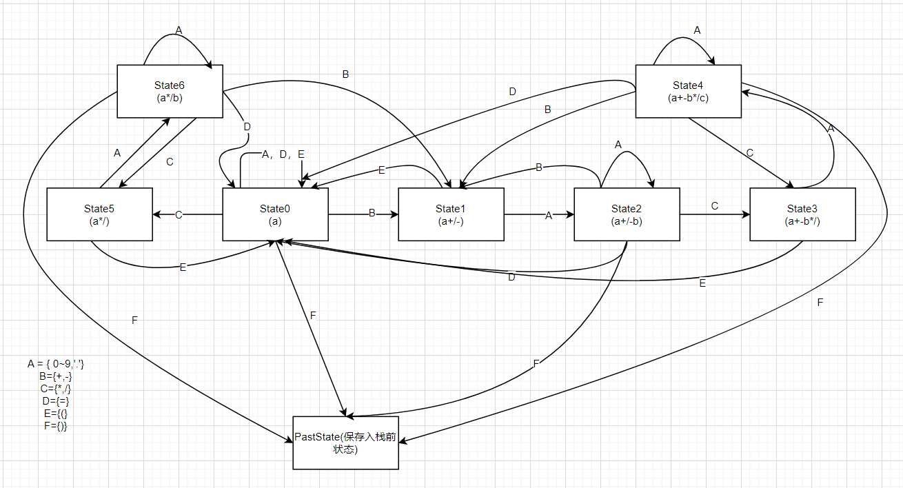

# Hardware-integrated-design
使用普中51-单核-A5实验箱，实现float类型混合四则运算以及括号操作
Lcd1602插入盒子上的接口
P1 接 jp3(反接)
P3 接 JP1
## 按键布局
矩阵键盘
-----------------------------  
---- 0 --- 1 --- 2 --- 3 ----  
---- 4 --- 5 --- 6 --- 7 ----  
---- 8 --- 9 --- X --- X ----  
---- X --- X --- X --- C ----  
-----------------------------  
C:clear,完成清屏
独立按键
-----------------------------  
---- + --- - --- * --- / ----  
---- ( --- ) --- . --- = ----  
-----------------------------  
## 功能
可以最多嵌套2层括号，float精度计算。使用状态图但包含括号部分对输入没有完善限制
